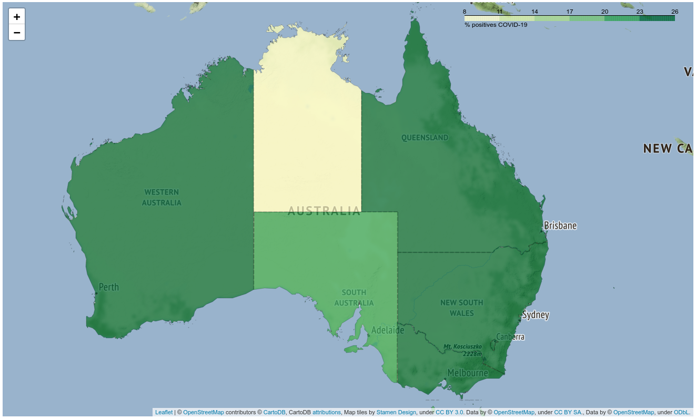

# COVID-19 Australian data cleaning and exploratory analysis

Data have been cleaned and deduplicated using the python package "fuzzywuzzy"
https://programtalk.com/python-examples/fuzzywuzzy.process.dedupe/

Code at 
https://github.com/opsabarsec/inria-aphp-assignment/blob/master/Australia_COVID-19_notebook_1.ipynb

The final cleaned dataset has then been analyzed and data plotted with Matplotlib. 
Code at 
https://github.com/opsabarsec/inria-aphp-assignment/blob/master/Australia_COVID-19_notebook_2.ipynb

Cloropleth maps of Australia are not shown by the GitHub website

Below full explanation (in French)

Exercice d'évaluation pour le poste Inria / AP-HP

Ce repository presente une analyse faite à partir de la base de données sqlite contenant 2 tables. Une table de patients et une table de tests PCR (test utilisé pour le diagnostic du Covid19).
Les données sont synthétiques et correspondent à la géographie de l'Australie

## 1. Nettoyage
Dans le jupyter notebook 'Australia_COVID-19_notebook_1'.

- imputation des valeur mancants
- imputation des valeurs aberrants (age des patients)
- deduplication :
Les données dupliquées ne sont pas identiques mais sont le résultat des problèmes de saisies de données (typos, information manquante etc.)
Aprés un nettoyage avec une "fuzzy deduplication" que utilise le critére de Levenshtein distance:
% doublons =  31.25

## 2. Analyse exploratoire de données (EDA )

Dans le jupyter notebook 'Australia_COVID-19_notebook_2'.

On représente visuellement avec graphiques, histogrammes, etc. le nombre de patients positifs au Covid19 (par tranche d'age, par localisation géographique etc.).

